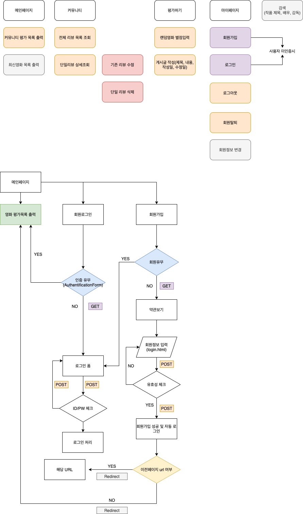

# movies 구현

---

## 소감

Django Framework 장고 프레임워크로 웹페이지를 구현할 때, 로그인을 구현하기 위해 장고 내의 ModelForm 을 활용하는 부분에서 어려움이 있었습니다.
어떤 경로에서 모델폼을 불러와야 할지, 폼은 어떻게 사용해야 하는지, 폼에는 어떠한 인자를 넣어야 하는지 등, Django 가 지닌 특징적인 요소를 익혀야 했습니다.
이를 맞추지 못하면 서버 에러가 나고, 에러페이지에서 원인을 찾아야 했습니다.

이를 해결하기 위해 1) 장고 공식 홈페이지에 들어가서 모든 문서를 살펴보고 2) 장고 github에 들어가 파일경로를 확인하며,  form 을 불러오는 경로를 이해하였습니다. 또한 class 와 그 클래스들의 하위 class 를 타고 들어가며 클래스와 메서드, 객체지향 프로그래밍을 이해하기 위해 노력하였습니다. 
그 결과 장고의  인증폼 authenticationForm (모델폼) 뿐만 아니라 MTV model (Model, Template, View) 모델을 총체적으로 이해할 수 있었고 추가적인 회원탈퇴나 회원정보수정, 비밀번호 수정 등을 구현할 때도 클래스, 메서드에 대한 이해를 바탕으로 큰 어려움 없이 웹페이지를 구현할 수 있었습니다.

## 0925 update

1. 오류 수정 (Logout)

   1. 원인 : logout view 함수는 Post 만 허용하도록 데코레이터를 붙였음. 그러나 인덱스 페이지에서 post 방식이 아닌 get 방식의 링크로 url이 연결
   2. 해결 : logout 을 form 형식으로 POST 전송

2. 로그인 구현

   1. AuthenticationForm 은 request를 첫 인자로 받음
   2. login 함수이름이 중복되는 것을 막기위해 함수명 변경
   3. auth_login의 두 가지 인자(requst, user) 를 받아오기 위해 form.get_user() 사용

3. 로그인 사용자에 대한 접근 제한 구현

   1. is_authenticated 속성을 활용하여 로그인과 비로그인 상태에서 출력되는 링크를 다르게 설정(html)

   2. is_authenticated 속성을 활용하여 로그인 상태라면 로그인하지 못하도록 막는다(view)

   3. is_authenticated 속성을 활용하여 로그아웃 상태라면 로그아웃을 하지 못하도록 막는다 (로그인 상태에서만 로그아웃 하도록 한다)(view)

   4. @login_required  데코레이터를 사용하여 로그인되어있지 않으면 기본 설정 경로로 리다이렉트하고 로그인되어있으면 정상적으로 함수를 실행

   5. 인증성공시 기존 요청주소로 리다이렉트(view) 

      ```python
      return redirect(request.GET.get('next') or '기존url')
      ```

4. 회원탈퇴 구현
   1. 회원정보 변경 내 링크 연결
   2. 회원가입 후 자동로그인 구현

```python
if form.is_valid():
  # 회원가입 후 자동로그인 진행
  user = form.save()
  auth_login(request, user)
return redirect('community:index')
```

5. 회원탈퇴 후 자동로그아웃 구현

```python
def delete(request):
    if request.user.is_authenticated:
        request.user.delete()
        auth_logout(request)
        return redirect('community:index')
```

6. 유저정보 구현
   1. UserChangeForm 을 상속받는 CustomUserChangeForm 을 새롭게 정의
7. 암호변경 구현
   1. PasswordChangeForm 사용 (인자 request.user)

8. 암호 변경시 세션 무효화 방지 추가

```python
if form.is_valid():
  form.save()
  update_session_auth_hash(request, form.user)
	return redirect('community:index')
```

9. admin 페이지 내 Model 출력 구현

```python
# admin.py
from django.contrib import admin
from .models import Review

# Register your models here.
class ReviewAdmin(admin.ModelAdmin):
    list_display = ('pk', 'movie_title', 'title', 'rank', 'content')

admin.site.register(Review, ReviewAdmin)
```


---


## 0924 update

1. 오류 수정 (Update)

   1. 원인 : update.html 의 수정 버튼의 action 을 실행할 때, Url과 함께 해당 게시글의 pk 정보도 함께 보내야 한다. 
   2. 해결 : review.pk 를 함께 전달

   ```python
    pk 정보를 꼭 함께 전송하자!! 
   <form action="" method="POST">
   
   {{ form.as_p }}
   <input type="submit" value="수정하기" class="btn btn-primary">
   </form>
   ```

2. 장고 숏컷 추가 : get_object_or_404(ModelClass, pk=pk)

```python
review = get_object_or_404(Review, pk=pk)
# review = Review.objects.get(pk=pk) 
```

3. HTTP 데코레이터 추가

```python
from django.views.decorators.http import require_http_methods, require_POST

@require_http_methods(["GET", "POST"]) 
@require_POST
```

4. HTML 들여쓰기 수정, form 태그 오류 수정

5. 오타수정

6. ' ' 경로는 홑따옴표로 통일

---




## 목표

- 데이터 생성, 조회, 수정, 삭제
- 데이터 조작
- ORM
- 관리자 페이지를 통한 데이터 관리
- Django ModelForm 활용한 HTML 과 사용자 요청 데이터 유효성 검증
- Authentication(사용자 인증) 에 대한 이해

## 키워드 
- CRUD 기본
- Forms
- Auth
- Admin
- Static

## 기능

1. 계정관리
   1. 회원가입
   2. 로그인
   3. 로그아웃
   4. 비밀번호 변경
   5. 회원탈퇴
2. 커뮤니티앱
   1. 신규 리뷰 생성
   2. 전체 리뷰 목록 조회
   3. 단일 리뷰 상세 조회
   4. 기존 리뷰 수정
   5. 단일 리뷰 삭제
3. 사용자 인증여부에 따른 네비게이션 변화
4. 어드민 페이지로 관리
5. 부트스트랩으로 꾸미기


## 상세정보
1. 계정관리 앱 (accounts)
   1. 회원가입 : 신규 사용자 생성
      - 이미 인증된 사용자가 요청을 보낸 경우 전체 리뷰 목록 페이지로 redirect
      - UserCreationForm 사용
      - HTTP method GET
        - 응답으로 signup.html 제공
        - form 작성정보는 POST 방식으로 제출
        - 회원가입 form 요소
      - HTTP method POST
        - 데이터 유효하면 전송된 데이터를 데이터베이스에 저장
        - 그 후 사용자를 인증(로그인)하고 전체 리뷰 목록 페이지로 redirect
        - 데이터가 유효하지 않다면 데이터를 작성하는 form을 에러메세지와 함께 표시
   2. 로그인 : 기존 사용자 인증
      - 인증되어있는 사용자는 전체 리뷰 목록 페이지로 redirect
      - AuthenticationForm 사용
      - HTTP method GET
        - 응답으로 login.html 제공
        - POST방식으로 form 제출
        - 로그인 form
      - HTTP method POST
        - 데이터 유효시 사용자 인증(로그인)
          - 로그인 하기 전 페이지 URL 이 함께 전송된 경우, 로그인 이후 해당 URL로 redirect
          - 이젠 페이지의 URL이 함께 전송되지 않았다면, 전체 리뷰 목록 조회 페이지로 redirect
   3. 로그아웃 : 인증된 사용자 해제
      - HTTP method 는 GET, POST 중 선택
      - 사용자 인증을 해제(로그아웃)하고 전체 리뷰 목록 페이지로 redirect
   4. 비밀번호 변경
   
2. 커뮤니티 앱 (community)
   1. 신규 리뷰 생성
      - 인증된 사용자만 새로운 리뷰 작성 가능
      - HTTP method GET
        - form.html 제공
        - 리뷰 작성할 form 표시
        - 
      - HTTP method POST
        - 데이터 유효시 데이터베이스에 저장하고 상세 조회 페이지로 redirect
        - 유효하지 않을시 데이터 작성 form 을 에러메세지와 함께 사용자 화면에 표시
   2. 전체 리뷰 목록 조회
      - index.html 
      - 제목 클릭시 해당 리뷰의 상세조회 페이지로 이동
   3. 단일 리뷰 상세 조회
      - detail.html
      - 리뷰데이터 없으면 404 에러페이지 표시
   4. 기존 리뷰 수정
      - 인증된 사용자만 리뷰수정 가능
      - HTTP method GET
        - 리뷰 수정 Form 표시
        - 
      - HTTP method POST
        - 데이터 유효시 데이터베이스 저장, 상세조회 페이지로 redirect
        - 데이터 미유효시 에러메세지 포함하여 다시 Form 표시
   5. 단일 리뷰 삭제
      - 삭제 완료시 전체 리뷰 목록 조회 페이지로 redirect

3. 인증 여부에 따른 화면 변화
   1. 네비게이션바 : 
      1. 사용자 인증여부 관계없이 전체 리뷰 목록 조회로 이동
      2. 사용자 미인증시 로그인과 회원가입 링크
      3. 사용자 인증시 새로운 리뷰작성 페이지 및 로그아웃 링크

4. 어드민 페이지 제작
   1. 관리자 페이지에서 Review, User 모델의 데이터 생성, 조회, 수정, 삭제 가능


## 모델

1. Review 모델
2. 사용자(User) 모델 : 장고 기본모델 사용


## Form

1. Review 모델의 데이터 검증, 저장, 에러메세지, HTML 관리 위해 ModelForm 사용
2. User 모델의 데이터 검증, 저장, 에러메세지, HTML 관리 위해 장고제공 ModelForm, Form 사용


## URL

app_name, name 사용


## View & Template

- 공유 템플릿 생성 및 사용


